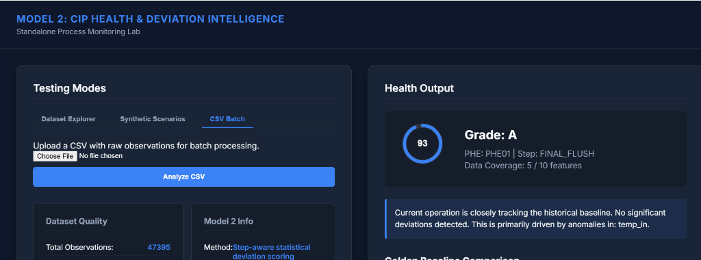
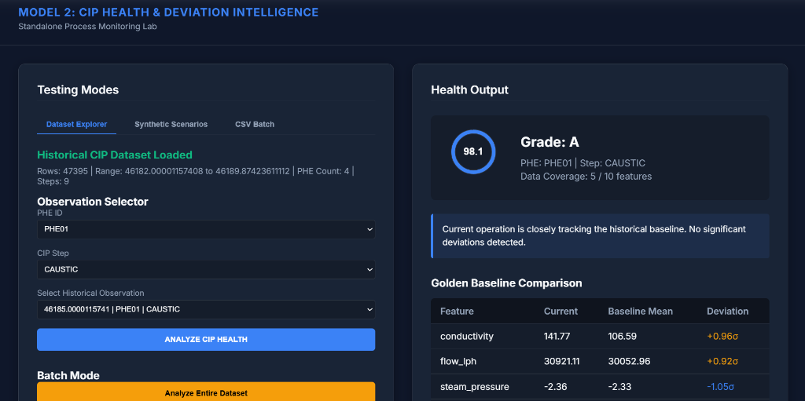
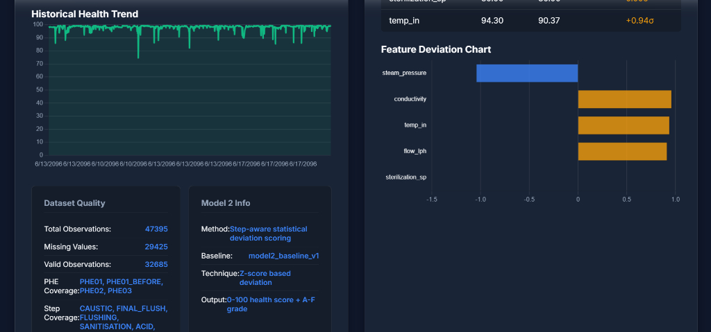
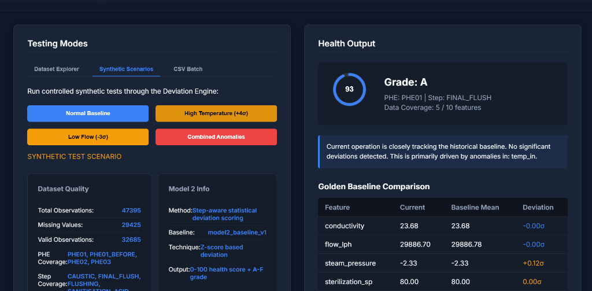

# CIP Health & Deviation Intelligence 🏭

**Project Status: Portfolio Ready — Standalone Model 2**

> This project represents the independently developed and validated Model 2 component of a broader industrial CIP intelligence platform. Future work will integrate this diagnostic engine into the main GOOSE CIP Dashboard for real-time operation.

---

### Why This Project Matters
This project demonstrates practical experience with:
* Industrial time-series data
* Real-world data preprocessing
* Statistical modeling & Feature engineering
* Explainable diagnostics
* Python & Flask APIs
* Data visualization
* Automated testing
* Industrial process understanding
* Deployment-oriented architecture

---

## 1. Project Positioning
**CIP Health & Deviation Intelligence** is an explainable, data-driven process-health system that learns historical Clean-In-Place (CIP) operating baselines and detects deviations in cleaning-process behavior.

This project is specifically focused on CIP process behavior, CIP steps, historical process baselines, sensor deviations, process health, explainability, and abnormal process behavior. (Note: This is not a general pasteurizer-health project; PHE01, PHE02, etc., are equipment identifiers associated directly with the CIP process).

## 2. Portfolio Story

### The Problem
Industrial CIP operations generate massive amounts of sensor data. However, operators often struggle to determine whether the *current* cleaning cycle is behaving normally. Simple threshold alarms identify extreme, catastrophic conditions but fail to answer the deeper question: 
> *"How different is this CIP cycle from historically normal behavior?"*

### The Solution
This project builds a historical **Golden Baseline** for CIP process behavior and compares current live observations against that baseline using standardized statistical deviations. 

**The Workflow:**
CIP Observation ➔ Equipment + CIP Step ➔ Historical Golden Baseline ➔ Feature Deviation ➔ Health Score ➔ A–F Grade ➔ Explainable Diagnosis

## 3. Methodology: Statistical Process-Health / Deviation Intelligence
**Technical Honesty:** This model is a **Statistical Process-Health & Deviation Engine**. It does not use deep learning, neural networks, or predictive supervised ML models, and it is not a regulatory certification tool. 

The model relies on robust statistical baseline analysis and Z-scores. Deviations are calculated using the formula:
```text
Z = (Current Value - Baseline Mean) / Baseline Standard Deviation
```
The largest deviations contribute to the final health interpretation, ensuring the system is completely transparent and mathematically explainable.

## 4. Real Industrial Data
The model was developed using historical CIP-related industrial data.
* **Size:** ~47,395 observations
* **Assets:** PHE01, PHE01_BEFORE, PHE02, PHE03
* **Resolution:** ~1-second median sampling interval

**CIP States Supported:** `CAUSTIC`, `ACID`, `FLUSHING`, `FINAL_FLUSH`, `SANITISATION`, `INITIAL_FLUSH`, `HOLD`, `CIP_STEP_7`, `CIP_ACTIVE_UNKNOWN`.

*Note: The dataset contains real industrial observations, but confidential/raw factory data is explicitly excluded from this public repository.*

## 5. The Golden Baseline
The system calculates step-aware and equipment-aware historical statistics. A `CAUSTIC` cycle on one CIP asset does not have the same operating profile as an `ACID` cycle on another asset.

For each `Equipment + CIP Step` combination, the baseline stores:
* Mean, Median, Standard Deviation
* Minimum, Maximum
* Observation Count (Minimum observation safeguards ensure statistical significance)

## 6. Engineered Features
The model actively monitors and engineers the following process parameters:
* `flow_lph`
* `temp_in`
* `sterilization_sp`
* `temp_error`
* `conductivity`
* `steam_pressure`
* `step_duration_s`
* `flow_rolling_mean`
* `temp_in_roc`

## 7. Health Score & Explainability
**Explainable > Black Box.** 

The output is not a binary "Abnormal/Normal" flag. It provides a deterministic process-health indicator relative to the historical baseline:
```text
Health Score: 88.3 / 100
Grade: B
```

The system identifies the dominant deviations causing the score reduction (e.g., `Flow -3.1σ`, `Temperature +0.8σ`) and produces a deterministic explanation identifying the primary source of deviation.

## 8. Model Test Lab
This repository includes a standalone, fully-featured Model Test Lab for interacting with the engine:
* **Dataset Explorer:** Select `Equipment` ➔ `CIP Step` ➔ `Historical Observation` ➔ `Analyze`.
* **Synthetic Scenarios:** Run controlled tests (e.g., Normal, High Temperature, Low Flow, Combined Anomaly).
* **Manual Testing:** Enter specific process values and instantly view the health calculation.
* **Historical Trend:** Visualize health and deviation behavior over time.

## 9. Future Integration with GOOSE CIP Dashboard
**Future Integration / Production Roadmap**

This repository is intentionally developed as a **standalone diagnostic module**. In a future production phase, this exact engine will be integrated into the main GOOSE CIP Dashboard to consume real-time CIP observations and provide continuous intelligence.

```text
Industrial Sensors
       |
       v
Siemens IIH / OPC UA / MQTT
       |
       v
GOOSE CIP Dashboard
       |
       v
CIP Health Intelligence API
       |
       v
Model 2 Deviation Engine
       |
       v
Health Score + Deviations
       |
       v
Dashboard Visualization
```

## 10. Architecture Diagram
```text
              HISTORICAL CIP DATA
                      |
                      v
              CIP DATA FILTERING
                      |
                      v
               PREPROCESSING
                      |
                      v
             CIP STEP SEGMENTATION
                      |
                      v
             FEATURE ENGINEERING
                      |
                      v
              GOLDEN BASELINE
                      |
                      v
             DEVIATION ENGINE
                      |
             +--------+--------+
             v                 v
       HEALTH SCORE       EXPLANATION
             |                 |
             +--------+--------+
                      v
                 FLASK API
                      |
                      v
             MODEL TEST LAB
                      |
                      v
          FUTURE CIP DASHBOARD
```

## 11. Testing & Validation
The system has been rigorously tested and validated:
* **Unit Tests:** 11/11 `pytest` suite passing.
* **Batch Performance:** 47,000+ observations processed in ~3.27 seconds.
* **Real-time Performance:** ~3-4 ms single-observation scoring.
* **Coverage:** Fully tested across reproducibility, edge cases, missing values, UI interactions, and API endpoints.

## 12. Limitations
* The model is statistical, not a trained supervised ML model.
* Baselines depend on the quality and representativeness of historical CIP data.
* Unknown CIP states require factory-domain validation.
* Some sensor values contain missing observations (handled safely by the engine).
* The public repository does not contain confidential raw factory data.
* Production integration with the main CIP Dashboard is future scope.
* The health score should not be interpreted as regulatory or cleaning-certification evidence.

## 13. Future Development (Planned Improvements)
* Expand historical CIP dataset and validate baseline assumptions with process engineers.
* Add more CIP assets and process steps.
* Investigate multivariate process-control techniques (e.g., MSPC).
* Add richer time-series deviation visualization.
* Integrate with real-time CIP Dashboard.
* Evaluate whether future versions should incorporate trained ML/anomaly-detection models and compare statistical baseline performance against ML alternatives.

## 14. Screenshots

**Main Model Lab / Hero**

*Demonstrates the core interface, showing a real CIP observation alongside its Grade and Health Score.*

**Real CIP Observation & Golden Baseline Comparison**

*Illustrates the exact feature-by-feature deviation breakdown (in sigmas) relative to the step-aware Golden Baseline.*

**CIP Health / Deviation Graph**

*Shows the historical process-health trend over a large batch dataset.*

**Explainability / Anomaly Analysis**

*Highlights the deterministic explanation generated during a simulated Combined Anomaly test.*

---
*Created as part of an advanced industrial AI portfolio project.*
